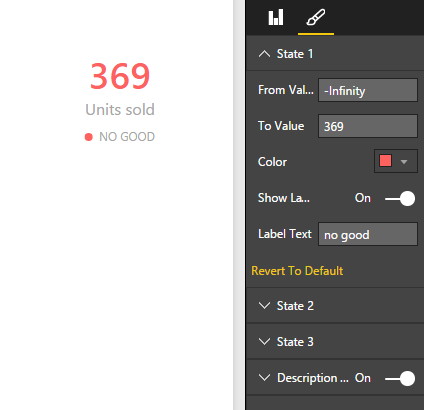

# Microsoft Power BI visuals plus custom visuals by [SQLBI](https://www.sqlbi.com)

The Microsoft Power BI visuals project provides high quality data visualizations that you can use to extend [Power BI](https://powerbi.microsoft.com/).  The project contains over 20 visualization types plus SQLBI custom visuals, the framework to run them, and the testing infrastructure that enables you to build high quality visualizations.  The framework provides all the interfaces you need to integrate fully with Power BI's selection, filtering, and other UI experiences.  The code is written in [TypeScript](http://www.typescriptlang.org/) so it's easier to build and debug. Everything compiles down to JavaScript and runs in modern web browsers.  The visuals are built using [D3](http://d3js.org/). This gives you everything you need to build custom visualizations for Power BI.


## Power BI Best Visuals Contest

- **Synoptic Panel by SQLBI** - [Grand Prize winner of the Power BI Best Visuals Contest](http://community.powerbi.com/t5/Best-Visual-Contest/con-p/best_visual_contest/tab/winners)

The Synoptic Panel connects areas in a picture with attributes in the data model, coloring each area with a state (red/yellow/green) or with a saturation of a color related to the value of a measure. Starting from any image (SVG supported), you draw custom areas using https://synoptic.design, which generates a JSON file you import in the Synoptic Panel. You can visualize data over a map, a planimetry, a diagram, a flow chart.

**Last updates:**

- Bind maps/areas to your data
- Import SVG graphics and the component will automatically detect every shape with a custom name
- Share your maps in the Synoptic Designer Gallery and import directly from the visual

http://www.sqlbi.com/tv/synoptic-panel-for-power-bi/


- **Bullet Chart by SQLBI** - 1st winner of the Power BI Best Visuals Contest's People Choice Award

Inspired by Stephen Few, here is the Power BI implementation of this beautiful space-saving indicator. It allows you to bind a main measure, a target, and a comparison measure.


- **Card with States by SQLBI**

Based on the Power BI builtin Card, this visual allows you to bind a performance value and define up to 3 states that determine the color of the main label. 
Plus: the Category Label is now fully customizable.




## What is included

1. Source code of all the visuals used in Power BI
2. Source code of **Synoptic Panel by SQLBI**
3. Source code of **Bullet Chart by SQLBI**
4. Source code of **Card with States by SQLBI**
5. [Sample data to use with custom visuals](src/Clients/Visuals/visuals/sampledata/)
6. A Playground app to help you try out the existing visuals, and experiment with the ones you have created

## Getting Started

### Prerequisites

To build the library and run the sample application you will need:

- [Git](http://git-scm.com/book/en/v2/Getting-Started-Installing-Git#Installing-on-Windows)
- [Node.js](https://nodejs.org/download/)
- Recommended IDE - [Visual Studio Community 2015](https://www.visualstudio.com/vs-2015-product-editions) (Free for use)
 -  Be sure to install the "Microsoft Web Developer Tools" optional feature. To install, go to Add/Remove Programs, right-click on Visual Studio, select Change, then Modify. Check the "Microsoft Web Developer Tools" checkbox and finish the install. 
 -  You can install [VSIX Package](https://github.com/Microsoft/PowerBI-visuals/blob/master/tools/VSIXExtensions/VisualTemplate.vsix?raw=true) and use Visual Studio Template from it to create new Visual.

### One-Time Setup
In order to build the Power BI visuals, ensure that you have [Git](http://git-scm.com/book/en/v2/Getting-Started-Installing-Git#Installing-on-Windows) and [Node.js](http://nodejs.org/download/) installed.

Clone a copy of the repo:

```
git clone https://github.com/danieleperilli/PowerBI-visuals.git
```

Change to the PowerBI-visuals directory:

```
cd PowerBI-visuals
```

Install dev dependencies:

```
npm install  # This command will install Gulp and all necessary modules
```

## Documentation

*  [Getting started](https://github.com/Microsoft/PowerBI-visuals/wiki)
*  [API specification](http://microsoft.github.io/PowerBI-visuals/interfaces/powerbi.ivisual.html)
*  [Power BI visuals playground (see our visuals live in action)](http://microsoft.github.io/PowerBI-visuals/playground/index.html)
*  [Power BI Homepage](https://powerbi.microsoft.com/)

## Additional instructions

### Running PlayGround from Visual Studio

Make sure you first follow the [Prerequisites](https://github.com/Microsoft/PowerBI-visuals#prerequisites) & [Onetime Setup](https://github.com/Microsoft/PowerBI-visuals#one-time-setup)

To run sample app:

1. Open `src\PowerBIVisuals.sln` in Visual Studio then under `src\Clients\PowerBIVisualsPlayground`, right click on `index.html` file and select 'Set As Start Page'.

2. Right click on the project root folder then select 'Property Pages'. In the window opened select 'Build' and then in 'Before running startup page' select 'No Build'.

3. Task runner should have kicked off an incremental build task, which will build each time you make changes. **NOTE:** Sometimes the task runner might kick off two of these tasks at the same time, just close one of them.

4. Ctrl + F5 to launch the Playground.
 
### Running Build and Test

Use the following commands to build and test:
```
gulp build  # Build Power BI visuals into `build` folder
gulp test  # Run unit tests (requires 'PhantomJS', see below)
```

### Installing PhantomJS
You will also need to do the following to run unit tests:

Install [PhantomJS](http://phantomjs.org/) (PhantomJS is a headless WebKit scriptable with a JavaScript API. It has fast and native support for various web standards: DOM handling, CSS selector, JSON, Canvas, and SVG.).

For Windows OS PhantomJS will be installed when you call `gulp test` command. Also you can install PhantomJS using this command:

```
gulp install:phantomjs
```
As result, local version of the PhantomJS will be downloaded and installed into the project. For other OS you have to install PhantomJS manually.

### Copyrights

Copyright (c) 2015 Microsoft and SQLBI

See the [LICENSE](/LICENSE) file for license rights and limitations (MIT).
